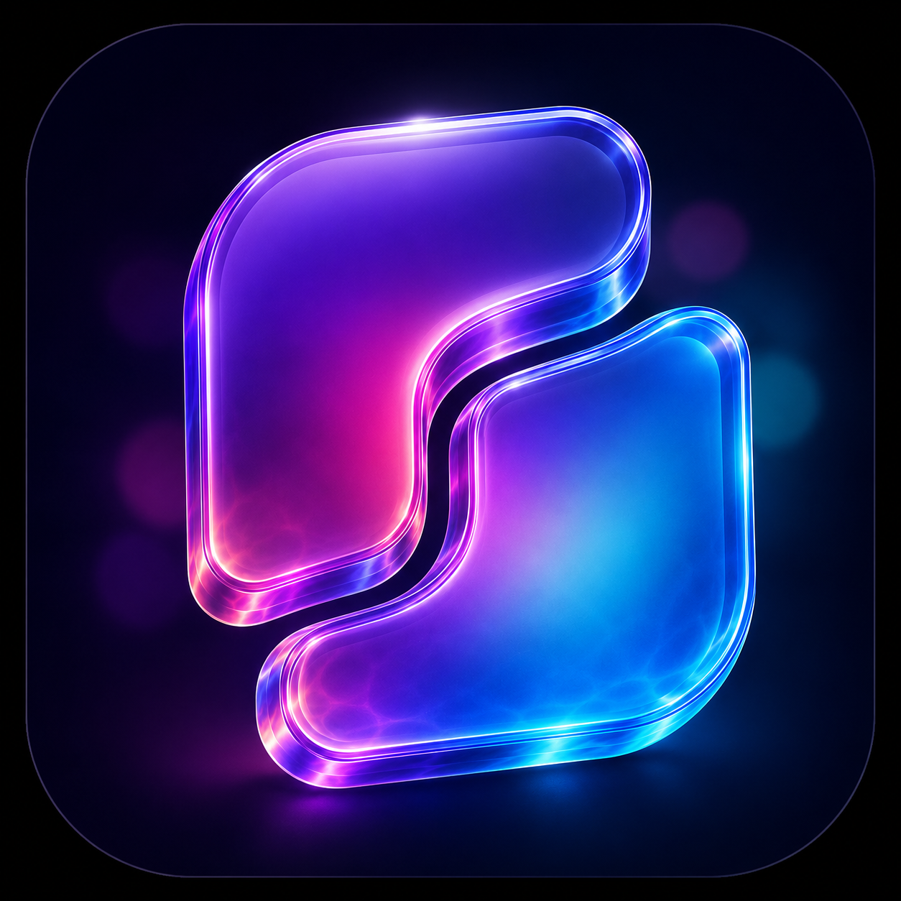

<p align="center">
  
</p>

# Neo Glass — Seelen UI Theme

A **neo-minimalist glassmorphism** theme, written from scratch, for the dock, toolbar, and every popup/flyout panel in Seelen UI. Inspired by "(Almost) Liquid Glass DockBar" (the liquid-glass/blur/shine language on the dock) and "Onyx Bubbles Light & Dark (Adaptive)" (the soft, light/dark-aware bubble items on the toolbar).

Built on Seelen UI's current `--slu-std-*` design tokens, so it automatically adapts to your Windows accent color and light/dark system theme.


## Installation

1. Download [`neo-glass.yml`](neo-glass.yml) (or grab it from the [latest release](../../releases/latest)).
2. Copy it into:
   ```
   %APPDATA%\com.seelen.seelen-ui\themes\
   ```
3. Open Seelen UI → **Settings → Resources → Themes**, find **Neo Glass** and enable it.
4. Fully quit Seelen UI (exit from the system tray) and reopen it.

## Highlights

- **Segmented toolbar** — instead of one continuous bar, the toolbar splits into independent floating glass islands (left: profile/apps, right: system tray)
- **Liquid glass dock** — floating dock with adjustable blur, glow, and edge highlight
- **Readable popups** — consistent glass effect across 17 widgets (quick settings, media controls, notifications, context menus, and more); text stays legible no matter what's behind the panel (busy wallpaper, dense text, etc.)
- **6 live-tunable variables** — adjust blur, opacity, corner radius, and border strength straight from Seelen UI's settings, no restart needed

## Screenshots

### Widgets

| Media panel | Wi-Fi panel |
|---|---|
|  |  |

### Live previews

<p>
  
  
</p>
<p>
  
</p>
<p>
  
  
</p>
<p>
  
  
</p>

## Customization

Once enabled, these variables can be tuned live from the theme's settings page:

| Variable | What it controls | Default |
|---|---|---|
| `--neo-glass-blur` | Background blur of the dock and toolbar | 22px |
| `--neo-glass-opacity` | Dock/toolbar glass opacity | 55% |
| `--neo-glass-radius` | Corner radius | 20px |
| `--neo-glass-border-opacity` | Edge line strength | 16% |
| `--neo-glass-popover-blur` | Blur of popup panels | 46px |
| `--neo-glass-popover-opacity` | Popup panel opacity (kept high for legibility) | 90% |

## Compatibility

- Seelen UI v2.7.x
- Tested widgets: `weg`, `fancy-toolbar`, `tooltip`, `context-menu`, `notifications`, `quick-settings`, `power-menu`, `bluetooth-popup`, `network-popup`, `calendar-popup`, `apps-menu`, `user-menu`, `system-tray`, `workspaces-viewer`, `keyboard-selector`, `flyouts`, `media-popup`

## Credits

Inspired by **(Almost) Liquid Glass DockBar** (@silva2307) and **Onyx Bubbles Light & Dark (Adaptive)** (@nevermore).
